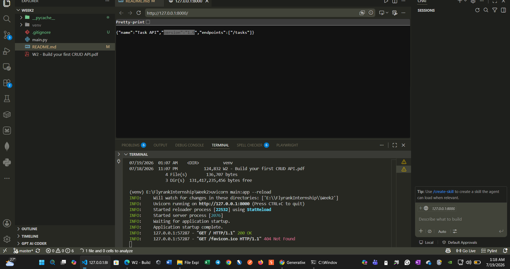
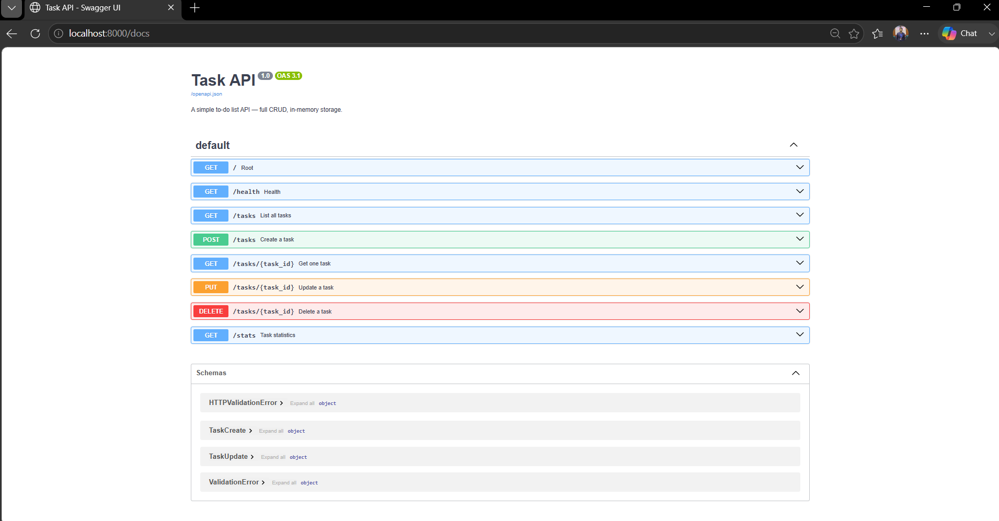
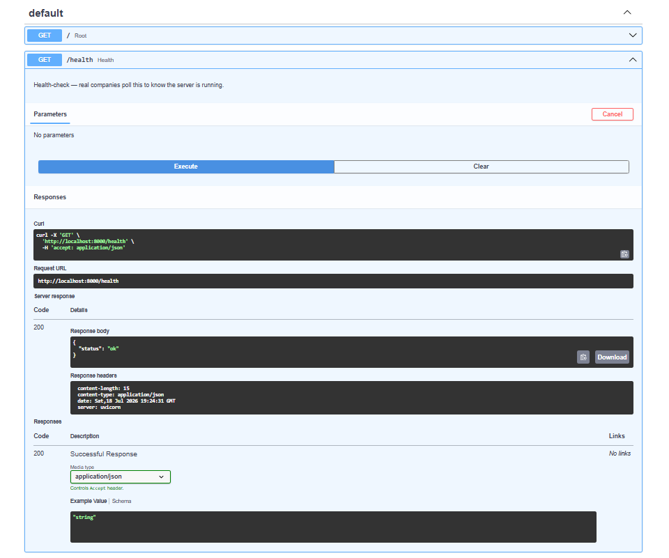
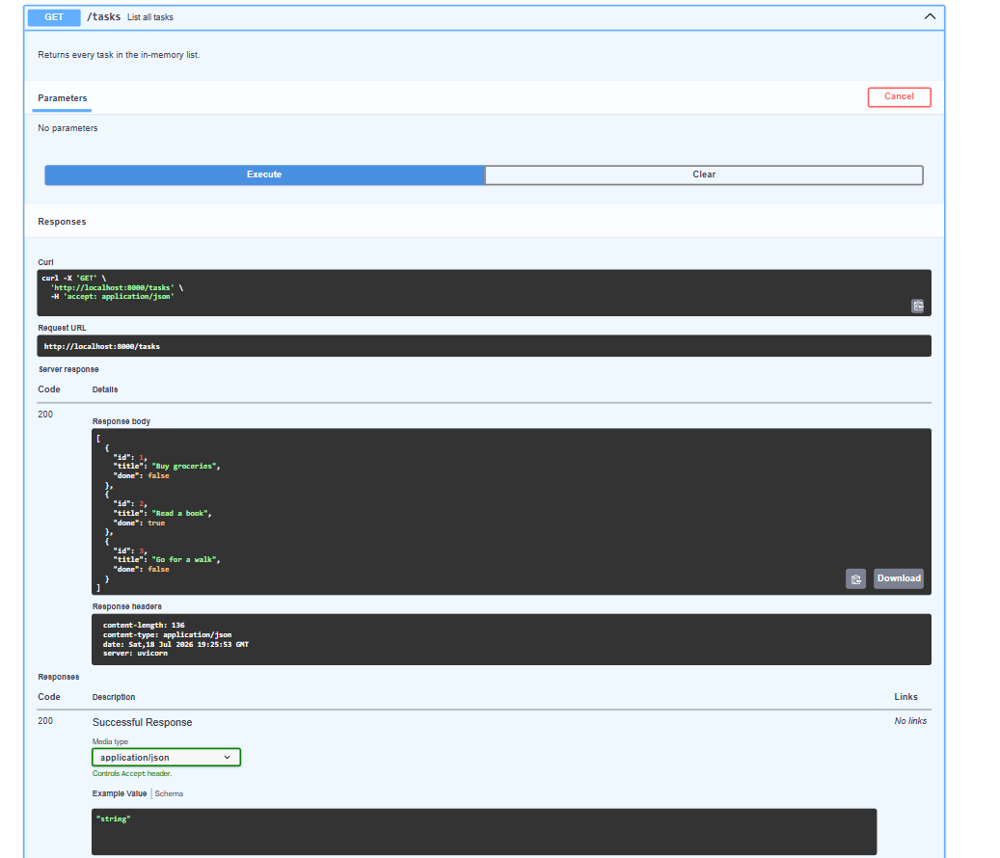
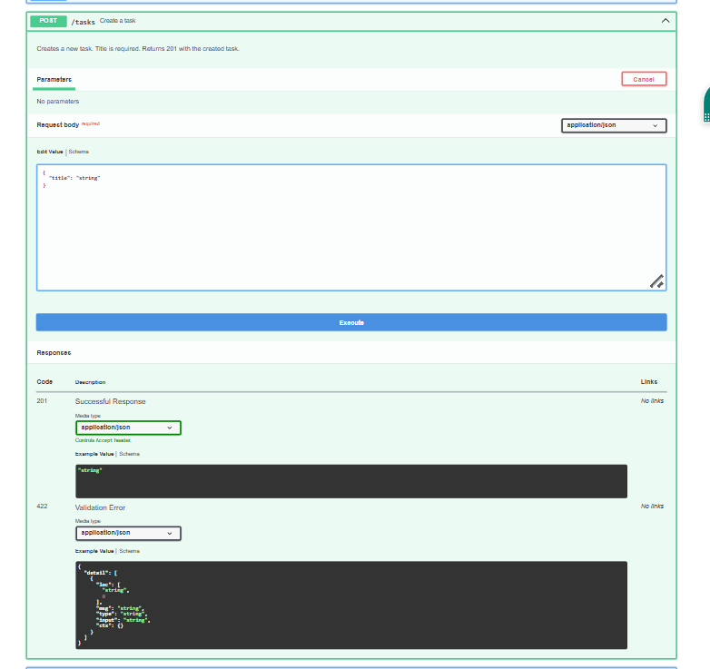
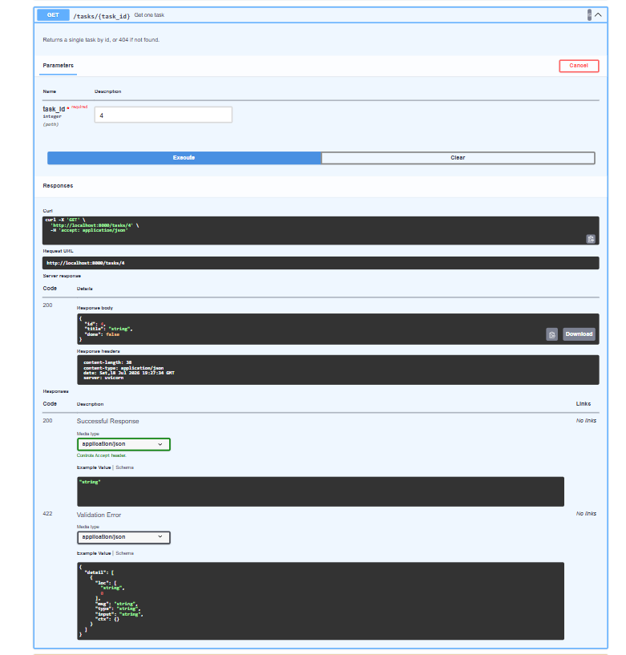
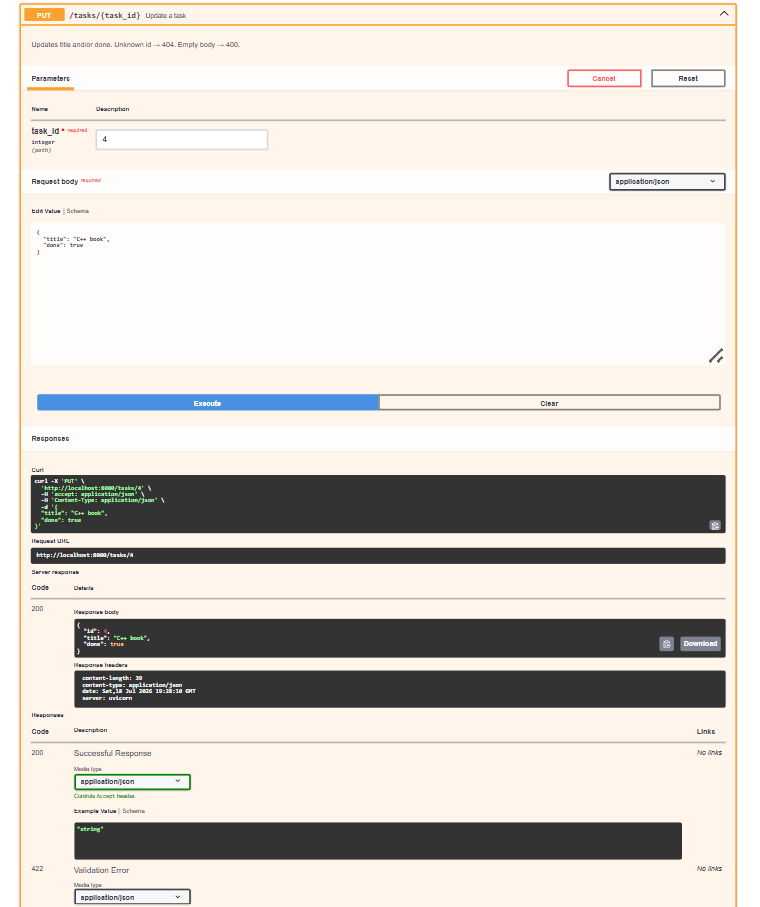
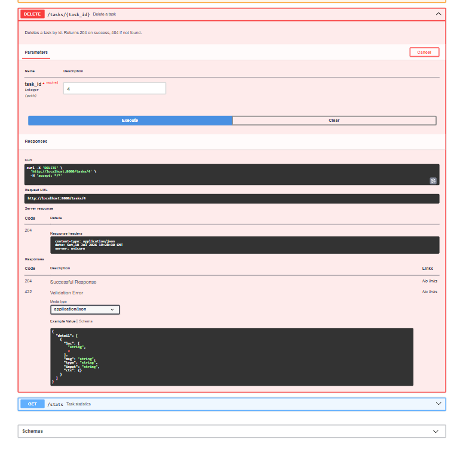
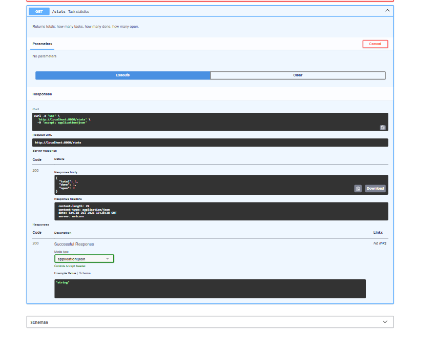

# Task API — FlyRank Internship W2A1

A to-do list REST API built with **FastAPI** (Python). Full CRUD on an in-memory list, with automatic Swagger UI at `/docs`.

---
### First setup virtual environment

# using venv
python -m venv venv

# activate
Scripts\activate

## Install & run

```bash
# 1. Install dependencies (one-time)
pip install fastapi uvicorn

# 2. Start the server
uvicorn main:app --reload

# Server is now live at http://localhost:8000
# Swagger UI:        http://localhost:8000/docs
```

---

## Endpoints

| Method | Path | Status | Description |
|--------|------|--------|-------------|
| GET | `/` | 200 | API info |
| GET | `/health` | 200 | Health check |
| GET | `/tasks` | 200 | List all tasks |
| GET | `/tasks/{id}` | 200 / 404 | Get one task |
| POST | `/tasks` | 201 / 400 | Create a task |
| PUT | `/tasks/{id}` | 200 / 400 / 404 | Update a task |
| DELETE | `/tasks/{id}` | 204 / 404 | Delete a task |
| GET | `/stats` | 200 | Task statistics |

---

## curl examples

```bash
# List all tasks
curl -i http://localhost:8000/tasks

# Get task 1
curl -i http://localhost:8000/tasks/1

# Create a task
curl -i -X POST http://localhost:8000/tasks \
  -H "Content-Type: application/json" \
  -d '{"title": "Buy milk"}'

# Update task 1 — mark it done
curl -i -X PUT http://localhost:8000/tasks/1 \
  -H "Content-Type: application/json" \
  -d '{"done": true}'

# Delete task 2
curl -i -X DELETE http://localhost:8000/tasks/2

# Stats
curl -i http://localhost:8000/stats

# 404 example
curl -i http://localhost:8000/tasks/999

# 400 example (missing title)
curl -i -X POST http://localhost:8000/tasks \
  -H "Content-Type: application/json" \
  -d '{}'
```

---

## Sample curl -i output

```
HTTP/1.1 201 Created
content-type: application/json

{"id":4,"title":"Buy milk","done":false}
```

---

## What happens when you restart the server?

All tasks disappear — the list lives only in RAM. The three seed tasks reload, but anything you created is gone. This is why databases exist (Week 3).

---

## API testing screenshots

### 1. API landing page


### 2. Swagger UI


### 3. Health check endpoint


### 4. Get all tasks


### 5. Create a new task


### 6. Get a task by ID


### 7. Update a task


### 8. Delete a task by ID


### 9. Get statistics


---

## Project structure

```
todo-api/
├── main.py      # All routes and logic — under 120 lines
└── README.md    # This file
```
