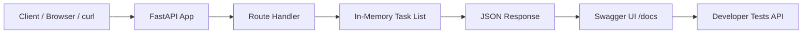

# Task API — FlyRank AI Internship Week 2 Assignment

This repository contains a lightweight REST API for managing tasks. It was built as my first hands-on assignment during the FlyRank AI internship program, focusing on backend development fundamentals with FastAPI.

## Overview

The Task API is a simple to-do application that supports full CRUD operations using an in-memory list. It demonstrates core API concepts such as routing, request handling, JSON responses, and interactive documentation through Swagger UI.

## Features

- Create, read, update, and delete tasks
- Retrieve task statistics
- Health check endpoint for monitoring
- Automatic API documentation at `/docs`
- Lightweight setup with Python and FastAPI

## Tech Stack

- Python
- FastAPI
- Uvicorn

## Project Structure

```text
todo-api/
├── main.py      # API routes and application logic
└── README.md    # Project documentation
```

## Setup Instructions

### 1. Create a virtual environment

```bash
python -m venv venv
```

### 2. Activate the environment

On Windows:

```bash
venv\Scripts\activate
```

### 3. Install dependencies

```bash
pip install fastapi uvicorn
```

### 4. Run the application

```bash
uvicorn main:app --reload
```

The API will be available at:
- http://localhost:8000
- Swagger UI: http://localhost:8000/docs

## API Endpoints

| Method | Path | Description |
|--------|------|-------------|
| GET | `/` | API information |
| GET | `/health` | Health check |
| GET | `/tasks` | Retrieve all tasks |
| GET | `/tasks/{id}` | Retrieve a single task |
| POST | `/tasks` | Create a new task |
| PUT | `/tasks/{id}` | Update an existing task |
| DELETE | `/tasks/{id}` | Delete a task |
| GET | `/stats` | Retrieve task statistics |

## Example Requests

```bash
# List all tasks
curl -i http://localhost:8000/tasks

# Get task 1
curl -i http://localhost:8000/tasks/1

# Create a task
curl -i -X POST http://localhost:8000/tasks \
  -H "Content-Type: application/json" \
  -d '{"title": "Buy milk"}'

# Update task 1
curl -i -X PUT http://localhost:8000/tasks/1 \
  -H "Content-Type: application/json" \
  -d '{"done": true}'

# Delete task 2
curl -i -X DELETE http://localhost:8000/tasks/2

# Get statistics
curl -i http://localhost:8000/stats
```

## Sample Response

```http
HTTP/1.1 201 Created
content-type: application/json

{"id":4,"title":"Buy milk","done":false}
```

## Notes

The task list is stored in memory, so all data will be lost when the server restarts. The application reloads the initial seed tasks on startup, which makes it ideal for learning and testing API behavior.

## Architecture Workflow

The application follows a simple request-response flow that is easy to understand for a beginner backend developer.



### How the workflow works

1. A client sends an HTTP request such as GET, POST, PUT, or DELETE to the FastAPI server.
2. The FastAPI application receives the request and routes it to the appropriate endpoint handler.
3. The handler processes the request and interacts with the in-memory task storage.
4. The server returns a JSON response containing the requested data or a success/error status.
5. The developer can test and inspect the API visually through Swagger UI at `/docs`.

This simple architecture is ideal for learning REST API design because it separates concerns clearly: routing, business logic, and data handling remain easy to follow.

## API Testing Screenshots

### 1. API landing page


### 2. Swagger UI


### 3. Health check endpoint


### 4. Get all tasks


### 5. Create a new task


### 6. Get a task by ID


### 7. Update a task


### 8. Delete a task by ID


### 9. Get statistics


